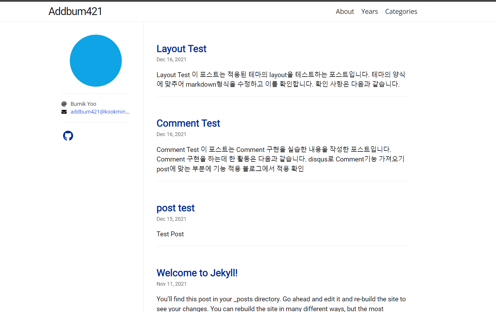

## Git Blog
### 20213028 유범익

### 목차
- 블로그 설명
- 구현과정
    - Jekyll 적용
    - Theme 적용
 
    
    
## 블로그 설명
이 블로그는 Hamilton 테마를 사용하여 만들어졌습니다. 해당 테마의 특징으로 포스트의 기간별 정렬, 카테고리별 정렬, 프로필 사진/외부 링크 추가가 있습니다.

이 사진은 블로그로 이동시 처음에 나오는 기본 화면입니다.

상단의 바에서 페이지를 선택할 수 있습니다. Years는 년도별로 포스트를 보여주고 Categories는 카테고리별로 포스트를 보여 줍니다.
각 포스트의 제목을 클릭해서 바로 해당 포스트로 이동할 수도 있습니다.

프로필에는 깃과 메일 주소가 있으며 이것 또한 email, 깃허브로 이동됩니다. 좌측 상단의 Addbum421은 Blog의 제목으로 클릭시 기본 화면으로 돌아옵니다.

## 구현과정
### Jekyll 적용
윈도우즈 환경에서 설치 후 Jekyll을 통해 초기의 블로그를 만들었습니다. 초기에는 테마가 따로 적용하지 안항 minimal 테마를 사용하였으며 _posts폴더에 post test라는 포스트를 올렸습니다.

post test에서는 title, date, category의 내용이 적용되어지는 지를 확인하고 ##이나 -등의 마크다운 기능을 사용하여 정상 작동여부를 확인하였습니다. 
이 과정에서 마크다운의 일부 형식이 잘못었고 수정하였습니다.

### Theme 적용
테마는 Hamilton 테마를 사용하였습니다. Hamilton 테마가 적용되는 지를 확인하기위한 test 포스트를 업로드 하고 다음 문제들을 확인할 수 있었습니다.

- 사용하지 않는 페이지가 존재
- 이메일, 깃주소가 기본값으로 설정되어 있음
- 기본 블로그에서 포스트가 나오지 않는 현상

첫번째 사항을 수정하기위해 해당 페이지의 내용이 들어있는 faq.md, docs.md 등의 파일을 삭제하였습니다. 
또한 해당 페이지로 이동하여 404에러 등이 발생하는 것을 막기 위해 페이지로 이동하는 링크가 있는 상단바를 수정하였습니다. 
상단바에 경우 _data/navigation.yml으로 관리 되어 파일에서 항목을 삭제하여 수정하였습니다.

두번째 사항은 _config.yml 파일을 수정하는 것으로 해결하였습니다. 또한 깃허브나 트위터의 링크가 연결되는 아이콘은
_data/social.yml에서 관리되어 이 또한 수정하여 해결하였습니다. 이 과정에서 블로그의 배경도 _config.yml의 skin을 추가하여 
흰색으로 변경하였습니다.

세번째 사항은 블로그의 테마를 적용할 당시에 index.markdown 등의 파일이 삭제되지 않아 발생하였고 다시 테마에 맞게 수정하여 해결하였습니다.

